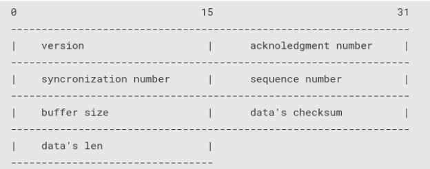
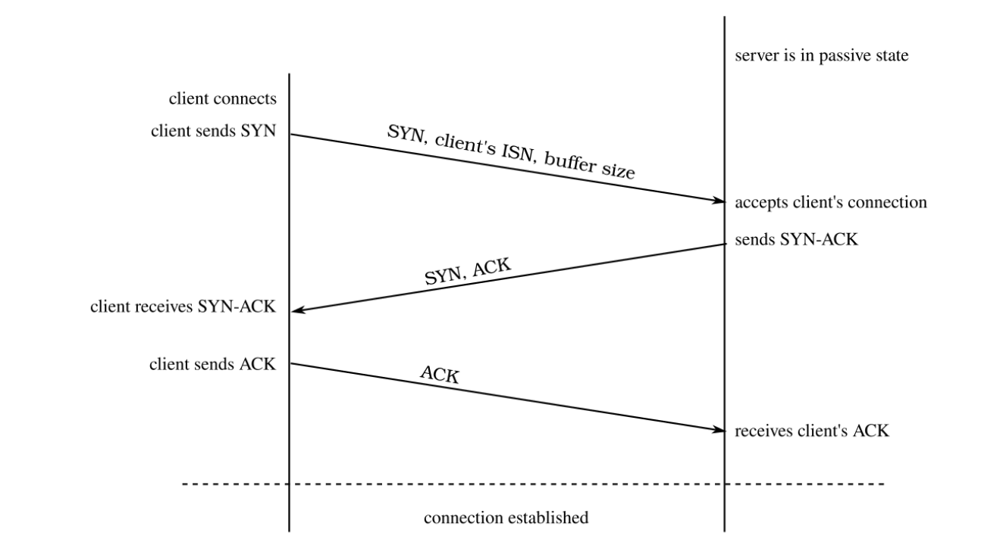
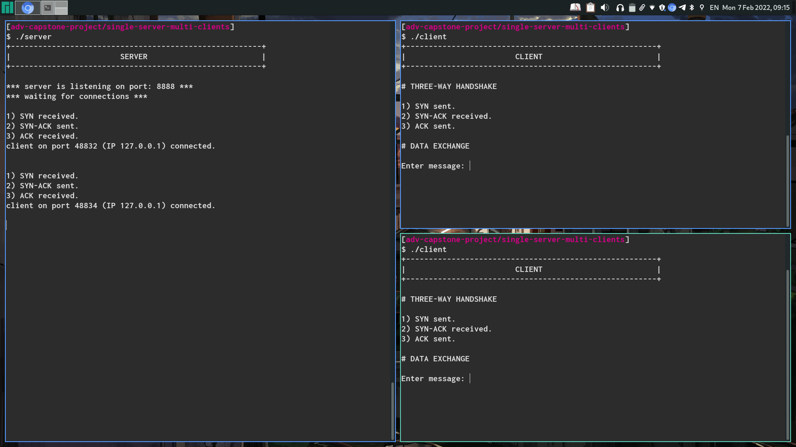
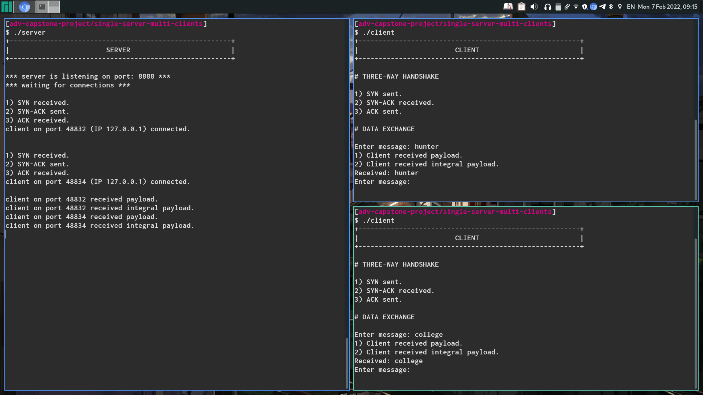

# CS499: Capstone Project

This repo is for Prof. Soumik's CS499 (Capstone) course at Hunter College, in
which I was tasked with a single-server single-client implementation, which
would later evolve into a single-server multi-client implementation, and finally
utilized as the networking backbone for a simple implementation of the
peer-to-peer distributed file system IPFS.

## Description

The single-server single-client implementation involved several stages of development:

1. In the first stage, I implemented a three-way handshake protocol between the
   server and the client in order to establish a connection.
2. In the second stage, I implemented the exchange of a payload, composed of a
   header and the data, between server and client besides handling a few DDOS
   attack cases.

### Three-Way Handshake

The three-way handshake started by describing the header protocol, and then how
the handshake would be carried out. 

#### Header Protocol

The header is 16 8-bit bytes in size and it’s arranged as follows:



* **Version:** the protocol’s version.
* **Acknowledgement number:** This is the ACK used to communicate acknowledgement.
* **Synchronization number:** This is the SYN used to communicate the
  willingness to connect.
* **Sequence number:** This contains the ISN (Initial Sequence Number).
* **Buffer size:** This contains the buffer’s size exchanged during the
  three-way handshake. After the three-way handshake, this is agreed-upon
  buffer’s size over which the data transmission happens.
* **Data’s checksum:** During the data exchange between client and server, this
  field contains the data’s checksum used to check for its integrity.
* **Data’s length:** This contains the data’s length transmitted and used to
  dynamically allocate the necessary memory to copy the data from the buffer.

### Three-Way Handshake Procedure

When a connection is established the following process, known as the three-way
handshake, is carried out:

1. The server finds itself in a passive open state, in which it’s prepared to
   accept an incoming connection from a client.
2. The client issues an active open by calling connect. During this process, the
   client sends a “synchronize” (`SYN`) packet, which signals the server the
   client’s willingness to connect it. This segment tells the server the
   client’s initial sequence number (`ISN`), which is randomly chosen, alongside
   the `SYN` flag set to 1 and the buffer’s size.
3. The server must acknowledge (`ACK`) the client’s SYN. Here the server sends a
   `SYN-ACK` segment with the server’s own `ISN`, `SYN` flag set to 1, and `ACK` set
   to the client’s `SYN + 1`.
4. The client checks the server’s `SYN-ACK` segment and acknowledges the server’s
   `SYN` by sending an `ACK` set to the server’s `ISN + 1`.



At each stage of the handshake, if the right segment doesn’t arrive either the
client or the server asks for a retransmission of the segment to either the
server or client respectively. Either the client or the server tries to
retransmit the segment an `N` number of times, after which it closes the
connection if `N` exceeds the maximum number of allowed retransmissions `M`. In the
current implementation, the maximum number of retransmission attempts is 3 by
default.

### Data Exchange

Once the three-way handshake is established, the server and client are ready for
exchanging data. During this data exchange, two use cases are addressed:

1. **Client receives data.** If the client receives some data from the server,
   then the program proceeds. Otherwise, the client issues a request for
   retransmission to the server. Once the server receives a retransmission
   request, it retransmits the same header and payload to the client an N number
   of times. The client is expected to receive the header and payload during one
   of those trials, otherwise the server closes the connection and the program
   exits.


2. **Data integrity.** Once the client receives some data, it checks its
   integrity by comparing the computed checksum against the checksum received
   from the client. If the checksums match, then the program continues.
   Otherwise the client issues a retransmission request to the server, which
   retransmits the header and payload for an N number of times. The client is
   expected to receive the payload and header during one of those trials,
   otherwise the server closes the connection and the program exits.

### Example

Connection established between a single server (left) and two clients (left):



Data exchange between a single server (left) and two clients (right):



## Compilation and Execution

To compile `server.c` and `client.c`, simply run `make`. This creates the executable `server` and `client`.

Open a terminal and execute `server`:

```
$ ./server
```

which displays the following:

```
+-------------------------------------------------------+
|                        SERVER                         |
+-------------------------------------------------------+

*** server is listening on port: 8888 ***
*** waiting for connections ***
```

In another terminal, execute `client`:

```
$ ./client
```

which displays the following:

```
+-------------------------------------------------------+
|                        CLIENT                         |
+-------------------------------------------------------+

# THREE-WAY HANDSHAKE

1) SYN sent.
2) SYN-ACK received.
3) ACK sent.

# DATA EXCHANGE

Enter message: 
```

Ther `server` terminal should look as follows:

```
+-------------------------------------------------------+
|                        SERVER                         |
+-------------------------------------------------------+

*** server is listening on port: 8888 ***
*** waiting for connections ***

1) SYN received.
2) SYN-ACK sent.
3) ACK received.
client on port 55800 (IP 127.0.0.1) connected.

```

If a message is typed in the `client` terminal:

```
+-------------------------------------------------------+
|                        CLIENT                         |
+-------------------------------------------------------+

# THREE-WAY HANDSHAKE

1) SYN sent.
2) SYN-ACK received.
3) ACK sent.

# DATA EXCHANGE

Enter message: Hello!
1) Client received payload.
2) Client received integral payload.
Received: Hello!
Enter message:
```

and the `server` terminal: 

```
+-------------------------------------------------------+
|                        SERVER                         |
+-------------------------------------------------------+

*** server is listening on port: 8888 ***
*** waiting for connections ***

1) SYN received.
2) SYN-ACK sent.
3) ACK received.
client on port 55800 (IP 127.0.0.1) connected.

client on port 55800 received payload.
client on port 55800 received integral payload.

```

Multiple clients can be connected to the single server.

## Group Project

For the IPFS implementation, the group outlined and gave a powerpoint
presentation how they would integrate their individual projects (i.e.,
networking, file systems, blockchain, machine learning and reinforcement
learning), however no code was written due to time constraint.
